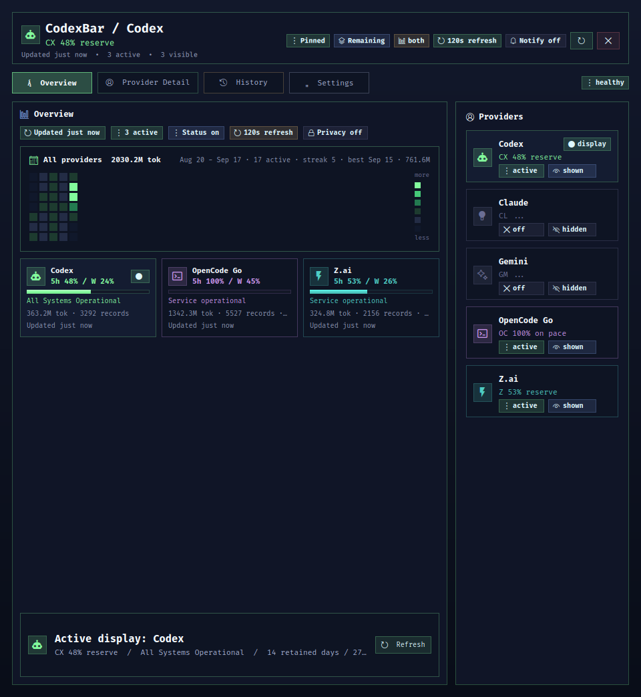

<p align="center">
  
</p>

# CodexBar

CodexBar is a Linux-first quota bar for Codex, Claude, Gemini, OpenCode Go, and Z.ai. It is an independent Linux implementation inspired by [the original CodexBar](https://github.com/steipete/CodexBar) by [Steipete](https://github.com/steipete).

The current product is a Ruby CLI/backend, a resident snapshot daemon, a compact Waybar JSON renderer, and one QuickShell panel. The supported runtime is Ruby + QuickShell + Waybar.

<p align="center">
  
</p>

## Current Contract

- Runtime language: Ruby.
- Human-facing UI: `frontend/quickshell/shell.qml`.
- Bar surface: Waybar calls `codexbar waybar render` and receives cached JSON.
- Background fetch path: `codexbar daemon` fetches providers and writes snapshots.
- State files: `snapshot.json` and `ui.json` under `runtime.stateDir`, defaulting to `~/.local/state/codexbar`.
- Config file: `~/.codexbar/config.json`, current config version `5`.
- Supported providers: `codex`, `claude`, `gemini`, `opencode`, and `zai`.

Provider fetches do not run inside Waybar. Waybar is only a render/action surface.

The QuickShell panel is split into Overview, Provider Detail, History, and Settings views. It reads presenter data from `snapshot.json` and sends mutations back through the Ruby CLI. Provider toggles update config and the cached snapshot immediately; provider quota fetches happen through `codexbar daemon`, `codexbar refresh`, or `codexbar usage`.

The Waybar chip shows compact provider quota percentages and health classes only. Pace labels such as `reserve` and `hot` stay in the QuickShell panel and provider detail cards.

Gemini quota is represented as separate model meters exactly as returned by the Gemini CLI-backed quota API, not as a single blended Pro/Flash pair. Gemini local usage is read from Gemini CLI chat JSONL records under `~/.gemini/tmp/**/chats/`. The provider-level Gemini status aggregates quota model meters: exhausted model buckets are still visible as critical meters, while mixed healthy and exhausted buckets make the provider warning rather than critical.

OpenCode Go quota is represented as its three subscription allowance windows as returned by the OpenCode Go usage endpoint: a five-hour rolling window, a weekly window, and a monthly window. These map to the primary, secondary, and tertiary lanes exactly like Codex. OpenCode Go local usage is read from the OpenCode usage database at `~/.local/share/opencode/opencode.db`, counting only assistant messages with `providerID` `opencode-go`; usage routed through other providers (OpenAI/ChatGPT, Moonshot/Kimi, free Zen `opencode` models) is not part of the subscription and stays excluded.

Z.ai quota is the GLM Coding Plan subscription allowance, not pay-as-you-go API credit. It is read from `https://api.z.ai/api/monitor/usage/quota/limit` as used-percentage windows: a five-hour window and a weekly window map to the primary and secondary lanes, and a monthly tools window maps to the tertiary lane when the account returns one. The API key comes from `ZAI_API_KEY`/`GLM_API_KEY`, or from the `zai-coding-plan` entry in `~/.local/share/opencode/auth.json` when you use Z.ai through OpenCode. Z.ai local usage is read from Z.ai-routed assistant messages in the OpenCode usage database (`providerID` `zai-coding-plan`/`zai`); those messages are separate from the OpenCode Go totals, which count only `providerID` `opencode-go`.

## Desktop Autostart

CodexBar has two separate runtime pieces:

- `codexbar daemon --config ~/.codexbar/config.json` refreshes provider quota state and writes `snapshot.json`.
- `codexbar waybar render --config ~/.codexbar/config.json` reads that cached snapshot and returns Waybar JSON.

Waybar does not refresh Codex, Claude, Gemini, OpenCode, or Z.ai by itself. If the daemon is not running after login or reboot, the Waybar chip can keep rendering, but it will render stale cached state. A desktop integration should therefore start and supervise the daemon at session startup.

On SolverForge Linux, the managed Waybar integration starts companion daemons through `solverforge-waybar-companions-start`, launched from Sway `exec_always` beside Waybar. That launcher restarts `codexbar daemon` if an early boot-time refresh failure makes it exit.

## Install

```bash
make install
make configure-user
```

By default this installs to:

- app tree: `~/.local/share/codexbar`
- CLI: `~/.local/bin/codexbar`
- config: `~/.codexbar/config.json`
- state: `~/.local/state/codexbar`

`make configure-user` creates the config if missing, preserves provider and display settings, and updates only `runtime.quickShellShell` to the installed QuickShell file.

For SolverForge Linux Waybar integration:

```bash
make install-solverforge-linux-integration
```

That installs the checked-in wrapper used by the existing SolverForge Waybar module. The normal product install does not edit SolverForge desktop config.

## Runtime

Core commands:

```bash
codexbar daemon
codexbar refresh
codexbar usage --provider codex,claude,gemini,opencode,zai --format json --pretty
codexbar config validate
codexbar waybar render
codexbar panel
codexbar ui open|close|toggle|status
```

Provider controls:

```bash
codexbar providers list
codexbar providers activate codex
codexbar providers deactivate claude
codexbar providers show gemini
codexbar providers hide gemini
codexbar providers pin codex
codexbar providers auto
codexbar providers overview add claude
codexbar providers overview remove claude
codexbar providers allow-auto gemini
codexbar providers block-auto gemini
```

`activate`, `deactivate`, `show`, `hide`, overview membership, and auto-select changes are local config/snapshot mutations. They do not synchronously fetch provider quota, so UI controls should feel immediate even when a provider credential path is slow or unavailable.

Display controls:

```bash
codexbar display status
codexbar display used
codexbar display remaining
codexbar display mode both
codexbar display mode percent
codexbar display mode pace
```

Runtime, status, and cached local intelligence:

```bash
codexbar runtime status
codexbar runtime cadence manual
codexbar runtime cadence interval 120
codexbar notifications enable
codexbar privacy hide
codexbar status
codexbar cost
codexbar history --format json --pretty
codexbar storage
codexbar cache clear status
codexbar serve --host 127.0.0.1 --port 8765
```

`codexbar serve` exposes cached JSON at `/health`, `/usage`, `/status`, `/cost`, `/history`, and `/storage`. It does not fetch providers from request handlers.

All providers are present in the default config, but provider entries default to disabled. Activate the providers this machine should fetch.

`codexbar bar` remains in the codebase as a bounded legacy direct-bar command. It is not the release UI path.

## Source-Tree Development

```bash
bin/codexbar config validate
bin/codexbar waybar render
bin/codexbar ui status --format json --pretty
```

Open the panel from the checkout:

```bash
env QT_QPA_PLATFORM=wayland \
  CODEXBAR_BIN=$PWD/bin/codexbar \
  CODEXBAR_CONFIG=$HOME/.codexbar/config.json \
  CODEXBAR_STATE_DIR=$HOME/.local/state/codexbar \
  quickshell --path $PWD/frontend/quickshell/shell.qml
```

Do not run the live desktop from the checkout if the checkout directory may be renamed. Install first, then run `make configure-user` so the user config points at the installed QuickShell path.

## Supported Providers

The release surface is exactly:

- `codex`
- `claude`
- `gemini`
- `opencode`
- `zai`

Codex and Claude expose named quota windows. CodexBar identifies Codex's five-hour and weekly windows from the durations returned by the Codex app-server rather than relying on response field order. A missing weekly window stays absent. On non-Pro ChatGPT plans, a missing five-hour value remains visibly unavailable in Waybar and QuickShell instead of being assigned a fabricated percentage; Pro displays only the returned account windows. Claude also exposes its Sonnet-specific tertiary window when present. Gemini exposes raw model-meter buckets such as `gemini-2.5-flash`, `gemini-2.5-pro`, and preview model buckets as returned by the Code Assist quota API. Local usage summaries cover Codex, Claude, Gemini, OpenCode Go, and Z.ai; Gemini summaries preserve per-model token totals from CLI chat logs, OpenCode Go summaries preserve per-model token totals from the OpenCode usage database, and Z.ai summaries preserve per-model token totals from Z.ai-routed assistant messages in that same database.

OpenCode Go exposes its five-hour rolling, weekly, and monthly allowance windows as returned by `https://opencode.ai/zen/go/v1/usage`. Percentages are used percentages, matching the OpenCode console. The five-hour, weekly, and monthly windows map to the primary, secondary, and tertiary lanes respectively; a missing window stays absent.

Z.ai exposes the GLM Coding Plan subscription allowance as used-percentage windows returned by `https://api.z.ai/api/monitor/usage/quota/limit`. The five-hour window maps to the primary lane and the weekly window to the secondary lane; a monthly tools window maps to the tertiary lane when the account returns one, and a missing window stays absent. This is the coding-plan subscription quota, not pay-as-you-go API credit. The API key is read from `ZAI_API_KEY`/`GLM_API_KEY`, or from the `zai-coding-plan` entry in `~/.local/share/opencode/auth.json` when Z.ai is configured through OpenCode. Local usage is read from Z.ai-routed assistant messages in the OpenCode usage database; the coding plan reports no per-token cost, so cost stays zero.

Retained history keeps each provider's shape: window providers store their primary/secondary/tertiary samples, Gemini stores per-model quota in `modelQuota` and model usage in `modelUsage`, and days with neither a quota sample nor local usage are omitted so the History view falls back to its empty state. The Overview renders every enabled, visible provider marked `showInOverview`; there is no fixed provider cap.

Other providers are not part of this Linux release.

## Validation

```bash
make syntax
make test
make smoke
make check
```

`make check` delegates to `bin/release-check`. It runs pre-commit, Bash syntax, per-file Ruby syntax, the Ruby test suite, config/smoke checks, Waybar render, UI status, and QuickShell load when QuickShell is available.

Stable release validation on a credentialed machine:

```bash
make check-live
```

`make check-live` requires working live credentials for Codex, Claude, Gemini, OpenCode, and Z.ai. Credential or upstream auth failures are release-environment blockers, not unit-test failures.

Run `make help` for the full colorized target overview. `make version` prints the version from `version.env`, and `make bump-patch`, `make bump-minor`, `make bump-major` (with `make bump-dry` to preview) run `commit-and-tag-version` so releases keep using the repository's `.versionrc.js` contract.

## Documentation

- `AGENTS.md`: repo-local implementation and release rules.
- `WIREFRAME.md`: current runtime, install, and UI contract map.
- `docs/installation.md`: install and SolverForge Linux integration.
- `docs/runtime-contracts.md`: config, snapshot, UI, and Waybar JSON contracts.
- `docs/architecture.md`: runtime architecture.
- `docs/providers.md`: implemented provider fetch paths.
- `docs/status.md`: external service-status cache behavior.
- `docs/cli.md`: command reference.
- `docs/RELEASING.md`: release gates.
